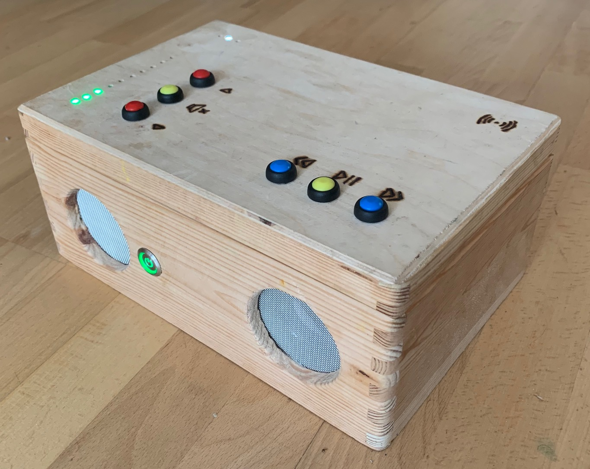

# jc://music-box/

A friend has built a similar box based on an existing free software (which I've never seen myself). As my children where faszinated by this box I decided to build such a box for my children, but to write the software on my own from the scratch. My intention is to try out different development practices. So it's not my idea but my individual implementation of this idea ...



## Status

At the moment I'm finishing a new box ... which means optimizing, testing and bug-fixing all the time. Not everything is working stable at the moment... . Stay tuned, I'm nearly finished.

## Table of Contents

- [What's inside](#whats-inside)
- [How to build the hardware](#how-to-build-the-hardware)
  - [Impressions](docs/INSTRUCTION_BUILD_HARDWARE.md#impressions)
  - [Required Components](docs/INSTRUCTION_BUILD_HARDWARE.md#required-components)
  - [Building the Hardware](docs/INSTRUCTION_BUILD_HARDWARE.md#building-the-hardware)
  - [Integrate IT Components](docs/INSTRUCTION_BUILD_HARDWARE.md#integrate-it-components)
  - [Overview Wiring](docs/INSTRUCTION_BUILD_HARDWARE.md#overview-wiring)
- [How to setup the software](#how-to-setup-the-software)
  - [Initial Raspberry Pi setup](#initial-raspberry-pi-setup)
  - [Prerequisites](#prerequisites)
  - [How to install, configure and run the software](#how-to-install-configure-and-run-the-software)
- [Autohotspot](#autohotspot)
- [Sources](#sources)
- [Disclaimer](#disclaimer)

## What's inside

This software is built to play music (MP3 / M4A files and web-streams) on a _Raspberry Pi 3B+_ in a wooden box with speakers. It consists of:

- **Client** to show and manage content and control playback (JavaScript/HTML5/CSS)
- **Server** to import and manage content and control playback (Python3)
- **LED Server** to show volume and status via LED (Python3)
- **Button Server** to read commands via push buttons and send to main server (Python3)
- **RFID Server** to detect RFID cards (Python3)

The jc://music-box/ uses VLC and several other [sources](#sources). It's written in PYTHON (server) and JAVASCRIPT (client).

## How to build the hardware

Find here some [instructions including pictures and wiring diagrams](docs/INSTRUCTION_BUILD_HARDWARE.md).

## How to setup the software

### Initial Raspberry Pi setup

If you want to use a fresh Raspberry Pi image, additional guidance can be found [here](docs/INSTRUCTION_PREPARE_RPI.md).

### Prerequisites

In order to use jc://music-box/ as it is you must have installed:

1. git
2. docker, docker-compose

The *server software* has been tested on a Raspberry Pi 3B+ with [Raspbian](docs/INSTRUCTION_PREPARE_RPI.md) and on an Ubuntu Desktop. RFID reader, LED and Buttons only tested on the Raspberry Pi.

The *client software* has been tested with Chrome 70.0, Firefox 68.0 and Safari on iOS 13 (iPhone XS, iPhone SE).

### How to install, configure and run the software

**1. Recommended directory structure**

  * *project directories:*
    * /projects/prod/
    * /projects/prod/mbox/
    * /projects/prod/modules/

  * *data directory:*
    * /projects_data/prod/


**2. Clone this repository and the modules**

```bash
$ cd /projects/prod
$ git clone https://github.com/jc-prg/mbox.git
$ git clone https://github.com/jc-prg/modules.git
```


**3. Activate SPI on your Raspberry via rasp-config to use RFID reader**

```bash
$ rasp-config
```


**4. Edit configuration files**

  Customize your configuration depending on your directory structure and needs:

```bash
$ cd mbox/config/
$ cp sample.config_prod config_prod     # create local configuration
$ nano config_prod                      # configure prod environment
$ ./create_prod
```


**5. Create the directory structure**

  The tested directory structure is:

```bash
$ cd install
$ ./install-datadir           # create required sub-directories in data-dir, chmod 777 for cover_upload
```

  * *data directories:*
    * /projects_data/test/
    * /projects_data/prod/

  * *structure inside the data directories:*
    * ./couchdb/
    * ./cover/
    * ./cover_upload/
    * ./data/
    * ./music/

  * *default structure of music directories:*
    * ./music/&lt;category&gt;/&lt;artist&gt;/&lt;album&gt;/


**6. Set the maximum loudness of the Raspberry to 100% (per default it's too low):**

```bash
$ amixer set PCM -- 100%
```


**7. Optional - mount USB device for music data**

```bash
$ cd /media
$ mkdir usb
$ mount /dev/sda1 /media/usb/
```


**8. Optional - Create a symlink to the right directory on you USB stick**

```bash
$ ln -s /media/usb/music /projects_data/prod/music
```


**9. Copy music files** 

  Copy files to the directory *./music/* (see suggested structure above) or to the USB device. Using an USB device makes it easier to add or change the music files ...


**10. Start server and client**

```bash
$ cd /projects/prod/mbox
$ sudo docker-compose -f docker-compose.yml up -d
$ sudo docker-compose -f docker-compose-rpi.yml up -d
```


**11. Open client and start "Reload Data" in the settings**

   Relevant default URLs are (the ports can be changed in the config file):

  * http://localhost:85/          - Client
  * http://localhost:5005/api/ui  - Swagger UI API description
  * http://localhost:5105/_utils  - Fauxton CouchDB access (default user:mbox; pwd:mbox)


**12. Optional - mount USB device during start up**

  To mount the device during start up add the line above to the /etc/rc.local - or alternatively add the following line to /etc/fstab:

```bash
/dev/sda1 /media/usb auto nosuid,nodev,nofail 0 0

```


**13. Optional - enable auto-start**

  Add the following to */etc/rc.local* before the "exit 0" or use the script *config/install-rclocal*. This script will be generated, when you create your configuration.

```bash
# jc://mbox/ client, database and server components (except the 2 above)
/usr/local/bin/docker-compose -f /projects/prod/mbox/docker-compose.yml up -d &
/usr/local/bin/docker-compose -f /projects/prod/mbox/docker-compose-rpi.yml up -d &
```

## Autohotspot

Usually the box is used in our home wifi. But as my kids like the box we take it with us when we travel.
Without remote access to the box it's not possible to use the app or to change some configurations on the box.
To solve this, the script found on https://www.raspberryconnect.com/ automatically creates a wifi-hotspot, 
when the box cannot connect to the home-wifi. So you it's possible to get access to the app even in the car.

Follow the instructions to install the [Autohotspot](docs/INSTRUCTIONS_AUTOHOTSPOT.md).


## Sources

The following packages are used within this software (thanks to the authors):

* VLC: https://www.videolan.org/
* MFRC522: https://github.com/mxgxw/MFRC522-python
* ...

## Disclaimer

I'm just starting to publish my code and to work with GitHub. So the projects are not complete at the moment but will grow.
The software can be used "as is" or feel to modify. I'll give no warranty that it works for you and is free of bugs. Ideas and suggestions what and how to improve are welcome.

