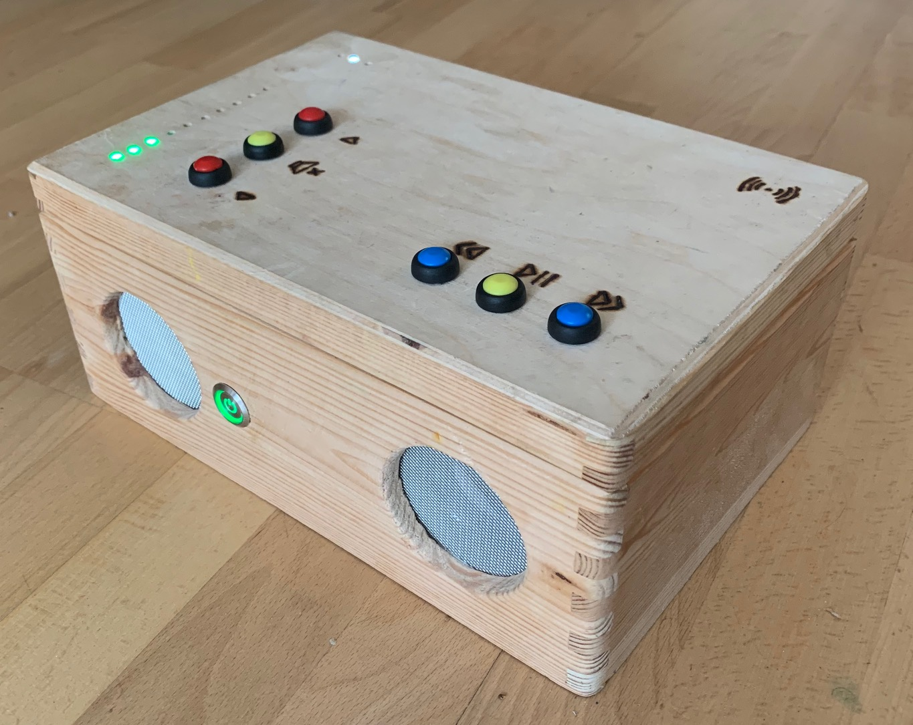
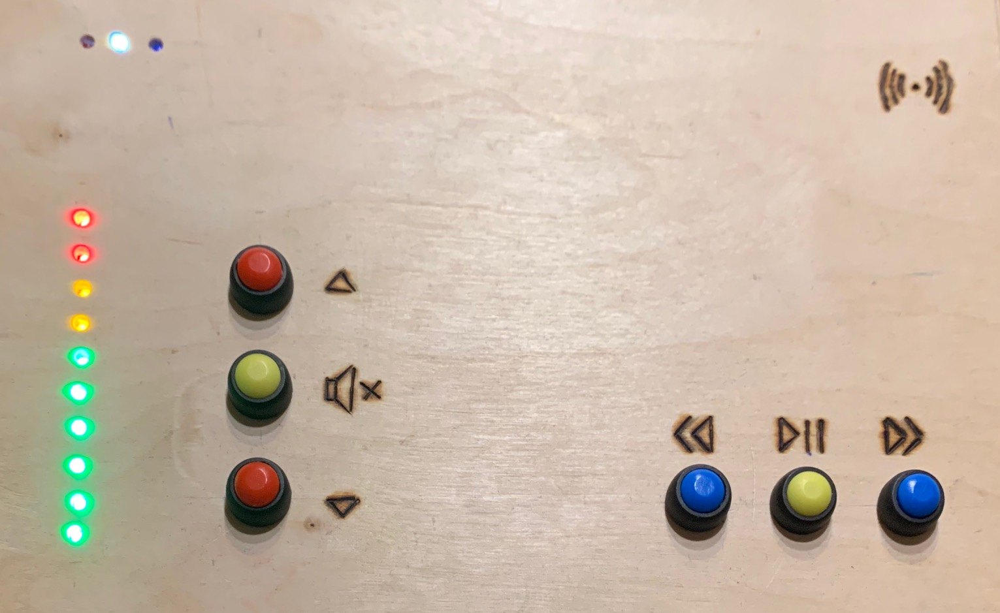
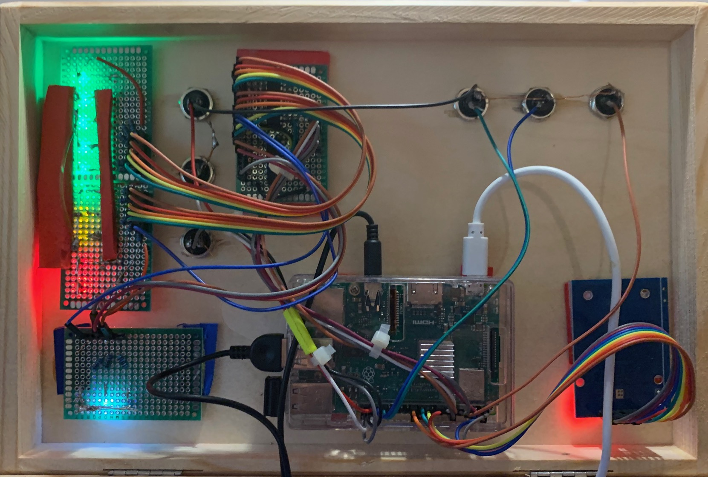
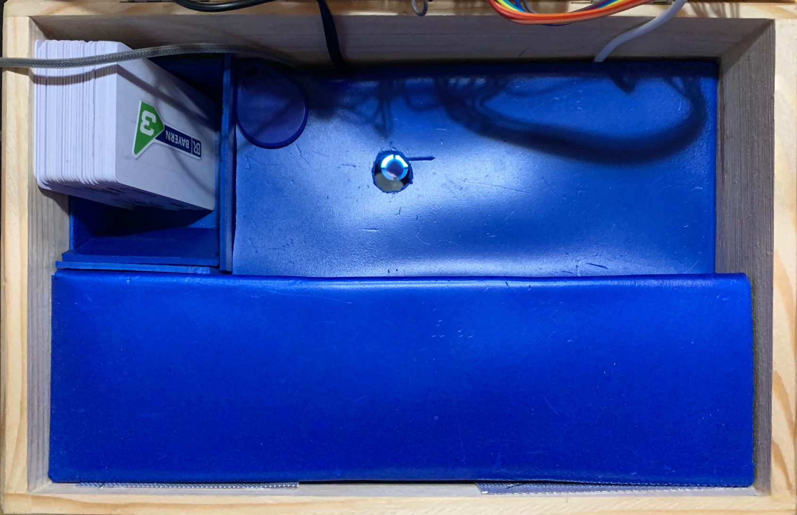

# jc://mbox/hardware

## Impressions

An instruction how to build the box will follow. Until then here a few impressions of my first jc://mbox/ ...

## The Wooden Box

## The Lid from Outside

## The Lid from Inside

## The Inner Box

## The Software (on an iPhone)

