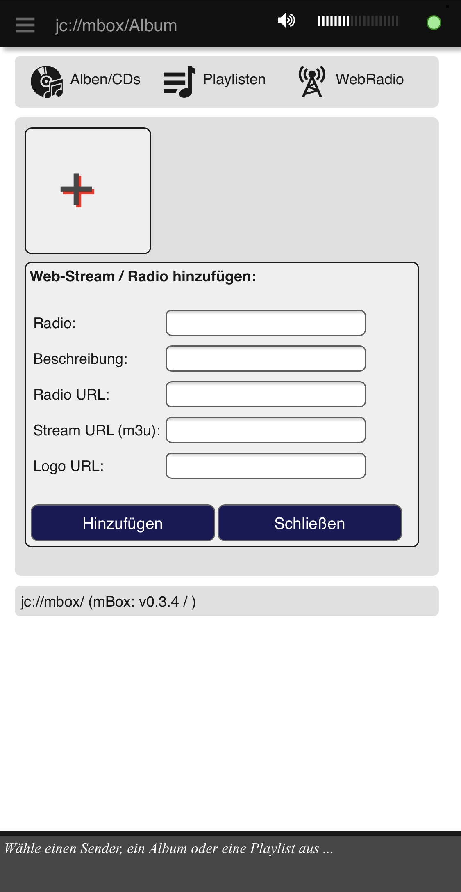
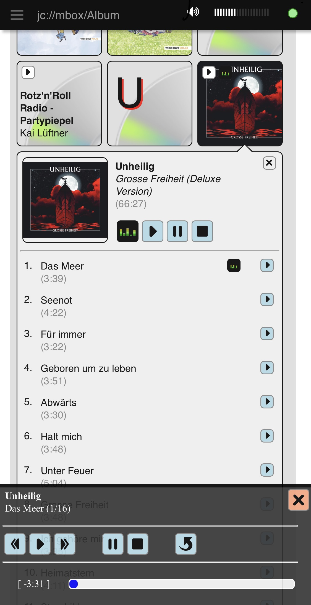

# jc://mbox/hardware

## Table of Contents

- [Impressions](#impressions)
  - [The Wooden Box](#the-wooden-box)
  - [The Lid from Outside](#the-lid-from-outside)
  - [The Lid from Inside](#the-lid-from-inside)
  - [The Inner Box](#the-inner-box)
  - [The Client (on an iPhone)](#the-client-on-an-iphone)
- [Required Components](#required-components)
- [Building the Hardware](#building-the-hardware)

## Impressions

An instruction how to build the box will follow. Until then here a few impressions of my first jc://mbox/ ...

### The Wooden Box


### The Lid from Outside


### The Lid from Inside


### The Inner Box


### The Client (on an iPhone)



## Required Components

*Box:*
* 1x Wooden box (30cm x 20cm x 14cm)

*Computer:*
* 1x Raspberry Pi 3B+
* 1x 16GB microSDHC Card
* 1x 32GB USB Stick (e.g. Intenseo Micro Line)* 1x Transparent case for the Raspberry Pi
* 1x USB Speaker (e.g. Hama PC Speaker Sonic Mobil 181)
* 1x USB Power bank (recommend with 20.000 mAh)
* 2x USB Power extension cable (Type A Male / Micro USB Male)

*Peripheral equipment:*
* Several jumper wires (male-female)
* Several breakaway connector bridges (female)
* 4x perforated grid board (Lochrasterplatte)
* 1x 74HC595 8-bit shift register
* Several LED (e.g. 6x green, 2x yellow, 3x red, 1x white, 1x blue)
* 6x colored push-buttons
* 1x LED Power Switch
* 8x double screw terminal blocks (wire to board connector)
* 1x RFID Reader: RFID Kit RC522
* Several RFID key cards 13,56 Mhz

## Building the Hardware
## Integrate IT Components

The IT components are connected via GPIO with the Raspberry Pi. A documentation can be found here: [https://www.raspberrypi.org/documentation/usage/gpio/](https://www.raspberrypi.org/documentation/usage/gpio/).
The GPIO pins are define in the file: [./server/modules_gpio/config.py](../server/modules_gpio/config.py).

### Integrate Raspberry Pi and PowerBank
### Integrate Power-Switch
### Integrate RFID Kit RC533

The integration of the RFID Kit RC533 is relatively easy. The cabling is described here: [https://tutorial.cytron.io/2018/08/15/reading-rfid-tag-using-mifare-rc522-raspberry-pi/](https://tutorial.cytron.io/2018/08/15/reading-rfid-tag-using-mifare-rc522-raspberry-pi/).
Additionally the cabeling is documented (not configured) in the file [./server/modules_gpio/config.py](../server/modules_gpio/config.py).
To run the module software have to be installed:

```bash
# activate SPI for your Raspberry Pi: "Advanced Options" > "SPI"

$ sudo raspi-config

# tbc. if required ....

$ sudo apt-get install git python-dev --yes

# Python SPI Modul

$ git clone https://github.com/lthiery/SPI-Py.git
$ cd SPI-Py
$ sudo python setup.py install
$ cd ..
```

To test if it's working you can download and use the following repository:

```bash
# Raspberry Pi RFID RC522 Modules

$ git clone https://github.com/mxgxw/MFRC522-python.git
$ cd MFRC522-python
$ sudo python Read.py
```

### Integrate Buttons

